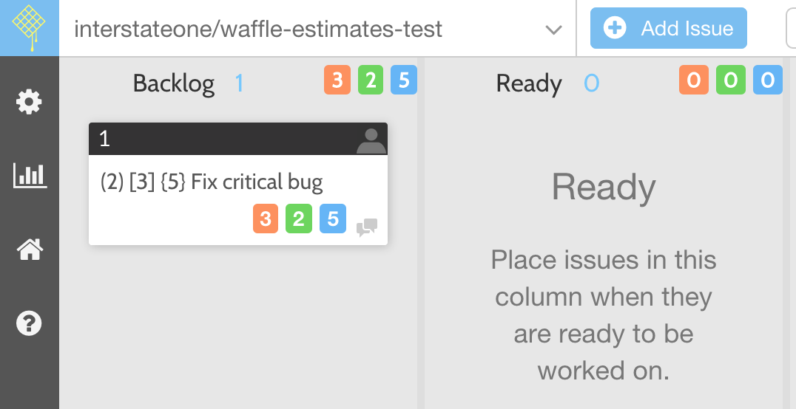

# Velocity Scores for waffle.io

Forked from https://github.com/rockerhieu/waffle.io-velocity-scores to provide support for multiple numbers. We use this to track {Estimated} (Done) [Remaining] on each card.

Originally: A Chrome extension for velocity scores on [waffle.io](https://waffle.io), ported from https://gist.github.com/jhubert/8eec558ab8cea9fd4aaa which renders velocity scores based on the content of the GitHub issue title.

## Installation

* Download the latest `*.crx` file from Releases. After the file is downloaded, you will see a warning `Apps, extensions, and user scripts cannot be added from this website`, ignore it.
* Open a new Chrome tab, navigate to `chrome://extensions/`.
* Drag and drop the downloaded `*.crx` file into the above Chrome tab to install.

## License

See the LICENSE file
